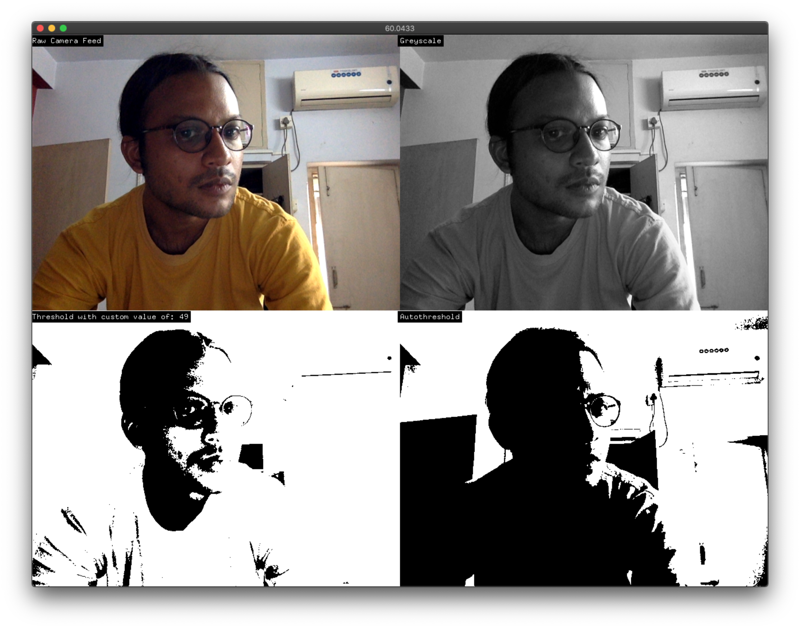
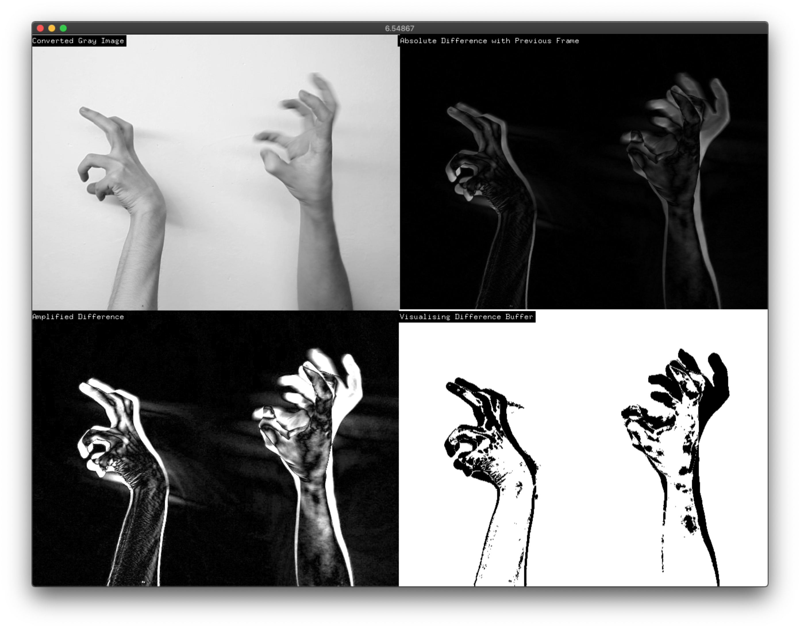
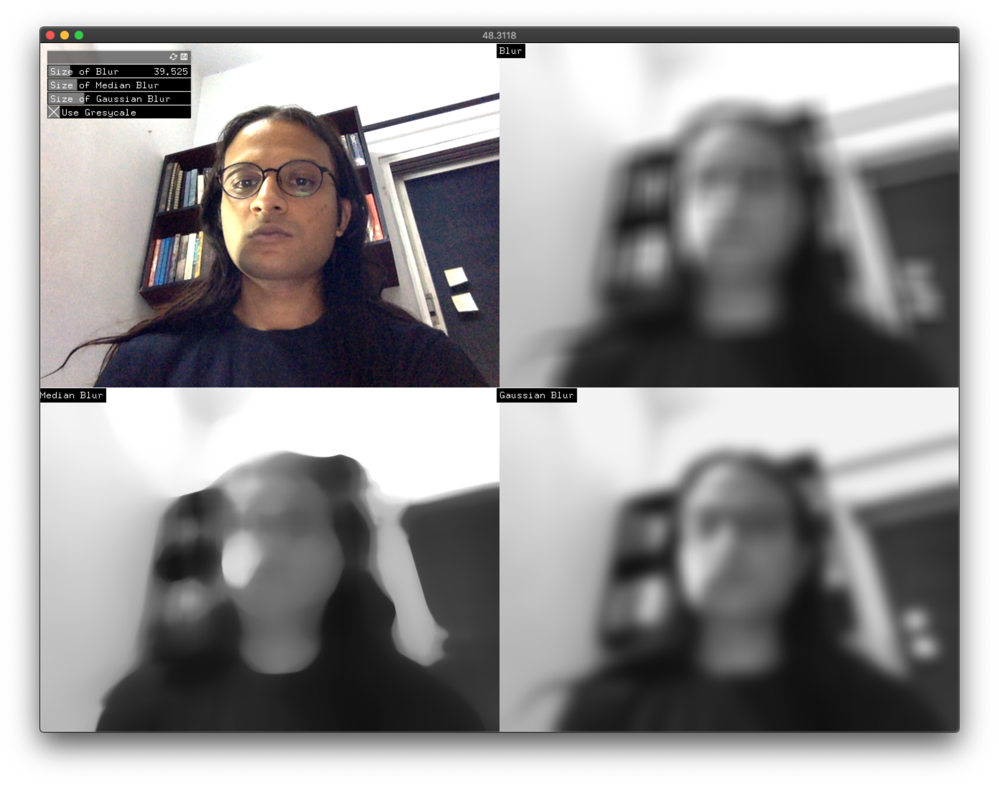

Personal studies in computer vision using openFrameworks and ofxCv as a lot of the resources and examples out there seem to be out of date with the latest oF version (0.10.x+). For posterity, will be maintaining a log here, in case it comes in handy for anyone else out there but I cannot promise that these will be the most efficient way of doing things. Feel free to follow along and send PRs in case you notice anything untoward.

Dependencies / [openFrameworks 0.10.x](https://openFrameworks.cc), [ofxCv](https://github.com/kylemcdonald/ofxCv), ofxGui (for some projects).

## 00_Thresholding

Opens the camera, converts to grayscale, and visualizes thresholding and autothresholding. Pressing `up arrow` increases the threshold value and `down arrow` decreases the threshold value.

Based on [example-threshold](https://github.com/kylemcdonald/ofxCv/tree/master/example-threshold) from the ofxCv repository.

## 01_FrameDifferencing

Plays back file, converts to grayscale, visualizes absolute frame difference, amplified frame difference and visualized buffer holding frame difference values.

Based on the [motion detection example](https://github.com/firmread/ofDemystified/tree/master/09-OpenCV-01-MotionDetection) from the book [Creative Coding Demysitfied by Denis Perevalov](https://www.packtpub.com/in/application-development/mastering-openframeworks-creative-coding-demystified).

## 02_Blurs

Visualizing the different kind of blurs available within the `ofxCv` wrapper, optionally converting to greyscale before applying the blur. Points to note: differing frame rate/performance between RGB and greyscale versions, as well as performance of the gaussian blur filter.
